.. include:: links.rst

.. _Usage :

Usage Notes
===========
.. warning::
   As of *PETPrep* 0.0.1, the software includes a tracking system
   to report usage statistics and errors. Users can opt-out using
   the ``--notrack`` command line argument.

Execution and the BIDS format
-----------------------------
The *PETPrep* workflow takes as principal input the path of the dataset
that is to be processed.
The input dataset is required to be in valid :abbr:`BIDS (Brain Imaging Data
Structure)` format. For a subject to be processed, the selected inputs for that
subject must include at least one PET scan, unless :option:`--anat-only` is
used. The workflow also requires anatomical information: either at least one
T1w structural image in the raw BIDS dataset, or reusable T1w preprocessing
derivatives supplied with :option:`--derivatives`.
At the beginning of the workflow, *PETPrep* checks each selected subject for
these required inputs. Subjects missing PET and/or anatomical data are skipped,
and a warning is emitted before subject-level workflows are built. The run only
errors if no selected subjects remain after these checks.
We highly recommend that you validate your dataset with the free, online
`BIDS Validator <https://bids-standard.github.io/bids-validator/>`_.

The exact command to run *PETPrep* depends on the Installation_ method.
The common parts of the command follow the `BIDS-Apps
<https://github.com/BIDS-Apps>`_ definition.
Example: ::

    petprep data/bids_root/ out/ participant -w work/

Further information about BIDS and BIDS-Apps can be found at the
`NiPreps portal <https://www.nipreps.org/apps/framework/>`__.

Combining multiple PET runs within a session
--------------------------------------------
Some PET datasets include multiple ``run`` acquisitions for the same
``subject``/``session``/``task``/``tracer``/``reconstruction`` combination
(for example, for long scans where the subject is in and out of the scanner).
When the runs belong together, add :option:`--combine-runs` to have *PETPrep*
concatenate them before building the preprocessing workflow.

Enabling :option:`--combine-runs` instructs *PETPrep* to create a temporary,
run-less copy of the BIDS tree in the working directory. PET files are grouped
by all matching PET entities except ``run``, ``suffix``, ``extension``,
``datatype`` and ``space``. Within each group, images are concatenated along
the frame dimension. Three-dimensional PET images are first treated as
single-frame series. Frame timing metadata from the individual sidecar JSON
files is merged with adjusted offsets, and the combined image and metadata are
written without the ``run`` entity in their filenames. Subsequent preprocessing
then operates on these merged series rather than the original per-run inputs.

The combined sidecar is written on the first run's time scale:

* When both ``TimeZero`` and ``InjectionStart`` are available, *PETPrep* requires
  them to imply the same offset. The ``InjectionStart`` difference is used so
  elapsed days are retained even though ``TimeZero`` contains only a time of day.
* If ``TimeZero`` is missing or malformed but ``InjectionStart`` is available,
  *PETPrep* can still use the injection-relative difference. ``TimeZero`` alone
  is not accepted because a time of day cannot distinguish same-day from
  multi-day acquisitions or establish that the runs share an injection.
* If an exact timing relationship cannot be determined, the runs overlap after
  adjustment, or the timing fields disagree, *PETPrep* stops with an error.
  It does not assume that runs are contiguous because doing so could erase a
  real gap while the subject was outside the scanner.

Using those offsets, *PETPrep* shifts ``FrameTimesStart`` and
``FrameReferenceTime`` into the combined time scale and concatenates
``FrameDuration``. If an input sidecar also includes derivative-style
``VolumeTiming`` metadata, that timing array is shifted in the same way as
``FrameTimesStart``. Frame-wise metadata arrays, such as ``ScaleFactor``,
``ScatterFraction``, ``DecayFactor``, ``DecayCorrectionFactor``, ``PromptRate``,
``SinglesRate``, and ``RandomRate``, are also concatenated when they can be
matched exactly to the number of frames in each run. Frame-wise arrays with
incompatible lengths are omitted from the combined sidecar to avoid writing
misleading metadata.

Every run must use the same non-empty ``Units`` value. ``FrameTimesStart`` and
``FrameDuration`` must each contain exactly one finite value per image frame.
PETPrep stops with an error rather than concatenating images with incompatible
quantitative units or incomplete required timing metadata.

All runs must define ``ImageDecayCorrected`` and a finite
``ImageDecayCorrectionTime``, and must agree on whether decay correction has
been applied. If all runs are uncorrected, the combined series remains
explicitly uncorrected; *PETPrep* does not apply a later decay correction
itself. If all runs are corrected to the same absolute time, their image values
are concatenated unchanged. If their absolute correction times differ,
*PETPrep* rescales each image to the first run's ``ImageDecayCorrectionTime``
and updates ``DecayFactor`` and ``DecayCorrectionFactor`` by the same factor.

Rescaling requires a consistent radionuclide half-life. An explicit
``RadionuclideHalfLife`` is used when available and consistent with a recognized
``TracerRadionuclide``. Otherwise, *PETPrep* recognizes common forms of
carbon-11, fluorine-18, nitrogen-13, and oxygen-15. Missing, mixed, ambiguous,
or inconsistent decay metadata cause an error rather than producing a combined
series whose quantitative values cannot be interpreted safely.

Because :option:`--combine-runs` removes the ``run`` entity before querying PET
files, it is intended for processing all runs in each matching group. Avoid
combining it with :option:`--run-label` unless you explicitly want run labels
ignored during the combination step.

Filtering PET inputs by BIDS entities
-------------------------------------
*PETPrep* can restrict which PET series are preprocessed by matching BIDS
entities in the input filenames. In addition to
:option:`--participant-label` and :option:`--session-label`, PET-specific
filters are available through :option:`--tracer-label`, :option:`--rec-label`,
and :option:`--run-label`. The :option:`--task-id` option similarly filters PET
inputs by task.

Use :option:`--rec-label` when a dataset contains multiple reconstruction
variants for the same acquisition and only a subset should be processed. The
option accepts one or more reconstruction identifiers, and the ``rec-`` prefix
is optional. For example, if a dataset includes files such as
``sub-01_rec-FBP_pet.nii.gz`` and ``sub-01_rec-OSEM_pet.nii.gz``, both can be
selected explicitly with: ::

    petprep data/bids_root/ out/ participant --rec-label FBP OSEM

The equivalent command with explicit BIDS entity values is also valid: ::

    petprep data/bids_root/ out/ participant --rec-label rec-FBP rec-OSEM

The convenience filters above apply to PET inputs only, so anatomical files are
otherwise resolved using the matching subject and session context. To constrain
anatomical inputs, provide an explicit query with :option:`--bids-filter-file`,
as shown below.

Filtering anatomical inputs by BIDS entities
---------------------------------------------
When working with PET data it is common to have multiple T1w images for the
same subject/session, for example one image with gradient nonlinearity
correction applied and one without (see the
`NonlinearGradientCorrection <https://bids-specification.readthedocs.io/en/stable/modality-specific-files/magnetic-resonance-imaging-data.html>`_
field in the BIDS specification). In this case, the desired T1w image can
be selected explicitly using :option:`--bids-filter-file`.

For example, when the JSON sidecars distinguish corrected and uncorrected images
with ``"NonlinearGradientCorrection": true`` and
``"NonlinearGradientCorrection": false``, respectively, the following
``bids_filter.json`` selects only the distortion-corrected T1w image::

    {
      "t1w": {
        "datatype": "anat",
        "suffix": "T1w",
        "NonlinearGradientCorrection": true
      }
    }

The filter file is then passed on the command line::

    petprep data/bids_root/ out/ participant \
        --bids-filter-file bids_filter.json

Metadata field names are case-sensitive. If correction status is not available
in the JSON sidecars but is encoded in a filename entity, that entity can be
used instead. For example, a dataset that uses
``rec-normdiscorr2d`` specifically for corrected images can replace the
``NonlinearGradientCorrection`` entry above with::

    "reconstruction": "normdiscorr2d"

Reconstruction labels are dataset-specific, so verify their meaning before
using them as a filter. The same approach can be applied to T2w images by using
the ``t2w`` query and ``T2w`` suffix.

.. _fs_license:

The FreeSurfer license
----------------------
*PETPrep* uses FreeSurfer tools, which require a license to run.

To obtain a FreeSurfer license, simply register for free at
https://surfer.nmr.mgh.harvard.edu/registration.html.

When using manually-prepared environments or singularity, FreeSurfer will search
for a license key file first using the ``$FS_LICENSE`` environment variable and then
in the default path to the license key file (``$FREESURFER_HOME/license.txt``).
If using the ``--cleanenv`` flag and ``$FS_LICENSE`` is set, use ``--fs-license-file $FS_LICENSE``
to pass the license file location to *PETPrep*.

It is possible to run the docker container pointing the image to a local path
where a valid license file is stored.
For example, if the license is stored in the ``$HOME/.licenses/freesurfer/license.txt``
file on the host system: ::

    $ docker run -ti --rm \
        -v $HOME/fullds005:/data:ro \
        -v $HOME/dockerout:/out \
        -v $HOME/.licenses/freesurfer/license.txt:/opt/freesurfer/license.txt \
        nipreps/petprep:latest \
        /data /out/out \
        participant

Using FreeSurfer can also be enabled when using ``petprep-docker``: ::

    $ petprep-docker --fs-license-file $HOME/.licenses/freesurfer/license.txt \
        /path/to/data/dir /path/to/output/dir participant
    RUNNING: docker run --rm -it -v /path/to/data/dir:/data:ro \
        -v /home/user/.licenses/freesurfer/license.txt:/opt/freesurfer/license.txt \
        -v /path/to_output/dir:/out nipreps/petprep:0.0.1 \
        /data /out participant
    ...

If the environment variable ``$FS_LICENSE`` is set in the host system, then
it will automatically used by ``petprep-docker``. For instance, the following
would be equivalent to the latest example: ::

    $ export FS_LICENSE=$HOME/.licenses/freesurfer/license.txt
    $ petprep-docker /path/to/data/dir /path/to/output/dir participant
    RUNNING: docker run --rm -it -v /path/to/data/dir:/data:ro \
        -v /home/user/.licenses/freesurfer/license.txt:/opt/freesurfer/license.txt \
        -v /path/to_output/dir:/out nipreps/petprep:0.0.1 \
        /data /out participant
    ...

FreeSurfer submillimeter reconstruction is disabled by default in *PETPrep*.
This avoids very large anatomical and GTM segmentation grids when PET data are
resampled into anatomical space. To opt in for submillimeter T1w inputs, pass
``--submm-recon``. The ``--no-submm-recon`` flag can be used to explicitly keep
the default behavior.

.. _prev_derivs:

Reusing precomputed derivatives
-------------------------------

Reusing a previous, partial execution of *PETPrep*
~~~~~~~~~~~~~~~~~~~~~~~~~~~~~~~~~~~~~~~~~~~~~~~~~~~
*PETPrep* will pick up where it left off a previous execution, so long as the work directory
points to the same location, and this directory has not been changed/manipulated.
Some workflow nodes will rerun unconditionally, so there will always be some amount of
reprocessing.

Using a previous run of *FreeSurfer*
~~~~~~~~~~~~~~~~~~~~~~~~~~~~~~~~~~~~
*PETPrep* will automatically reuse previous runs of *FreeSurfer* if a subject directory
is found in the configured FreeSurfer subjects directory. By default this is
``<output_dir>/sourcedata/freesurfer`` with ``--output-layout bids`` and
``<output_dir>/freesurfer`` with ``--output-layout legacy``.
Reconstructions for each participant will be checked for completeness, and any missing
components will be recomputed.
You can use the ``--fs-subjects-dir`` flag to specify a different location to save
FreeSurfer outputs.
If precomputed results are found, they will be reused.
If those precomputed results were generated with submillimeter reconstruction,
``--no-submm-recon`` will not downsample or rebuild them; use a fresh
``--fs-subjects-dir`` or rebuild the FreeSurfer subject without submillimeter
reconstruction to avoid high-resolution GTM/PET resampling.

BIDS Derivatives reuse
~~~~~~~~~~~~~~~~~~~~~~
As of version 0.0.1, *PETPrep* can reuse precomputed derivatives that follow BIDS Derivatives
conventions. To provide derivatives to *PETPrep*, use the ``--derivatives`` (``-d``) flag one
or more times.

This mechanism replaces the earlier, more limited ``--anat-derivatives`` flag.

.. note::
   Derivatives reuse is considered *experimental*.

This feature has several intended use-cases:

  * To enable PETPrep to be run in a "minimal" mode, where only the most essential
    derivatives are generated. This can be useful for large datasets where disk space
    is a concern, or for users who only need a subset of the derivatives. Further
    derivatives may be generated later, or by a different tool.
  * To enable PETPrep to be integrated into a larger processing pipeline, where
    other tools may generate derivatives that PETPrep can use in place of its own
    steps.
  * To enable users to substitute their own custom derivatives for those generated
    by PETPrep. For example, a user may wish to use a different brain extraction
    tool, or a different registration tool, and then use PETPrep to generate the
    remaining derivatives.
  * To enable complicated meta-workflows, where PETPrep is run multiple times
    with different options, and the results are combined. Processing of all sessions simultaneously
    would be impractical, but the anatomical processing can be done once, and
    then the PET processing can be done separately for each session.

See also the ``--level`` flag, which can be used to control which derivatives are
generated.

Head motion correction
----------------------
*PETPrep* can correct for head motion in the PET data.
The head motion is estimated using a frame-based robust registration approach to an unbiased mean 
volume implemented in FreeSurfer's ``mri_robust_template`` (Reuter et al., 2010), combined with
preprocessing steps using tools from FSL (Jenkinson et al., 2012). Specifically, for the estimation 
of head motion, each frame is initially smoothed with a Gaussian filter
(full-width half-maximum [FWHM] of 10 mm, :option:`--hmc-fwhm` ``10``),
followed by thresholding at 20% of the intensity range to reduce noise and improve registration 
accuracy (removing stripe artefacts from filtered back projection reconstructions). 
By default, motion is estimated from frames whose midpoint is later than
120 seconds post-injection (:option:`--hmc-start-time` ``120``), as earlier
frames often contain low count statistics. Frames before this point are
corrected with the transform estimated for the first selected frame. The robust
template estimation uses PET-oriented settings, including intensity scaling and
automatic sensitivity detection.

By default, *PETPrep* evaluates the frames acquired after
:option:`--hmc-start-time` and initializes motion correction with the
frame exhibiting the highest tracer uptake. Provide a zero-based index
with :option:`--hmc-init-frame` to override this choice. Adding
:option:`--hmc-init-frame-fix` keeps whichever frame is selected (automatic or
manual) fixed during robust template estimation to improve reproducibility.
Iterations are automatically disabled to reduce runtime when :option:`--hmc-init-frame-fix` is
used.

For PET series with many selected frames or large spatial dimensions, *PETPrep*
estimates the memory required by ``mri_robust_template`` after applying
:option:`--hmc-start-time`. With the default :option:`--hmc-memory-policy`
``auto``, if the data-driven estimate is high, *PETPrep* automatically fixes the
selected initial frame, disabling robust-template iterations, and uses a
FreeSurfer ``--subsample`` threshold when the spatial dimensions support safe
subsampling. The threshold is at most 200 and is lowered below the smallest
spatial dimension when needed so FreeSurfer's all-axis subsampling condition can
take effect, but is not lowered below 150 voxels. This keeps the workflow as a
single robust-template step while reducing peak memory pressure for long or
high-resolution dynamic PET acquisitions without forcing a very coarse
registration grid. The estimate, selected frame count and reason for the
decision are recorded in the workflow log; the chosen HMC settings are reflected
in the workflow boilerplate. Use :option:`--hmc-memory-policy` ``off`` to disable
these automatic memory safeguards and run HMC with only the explicitly requested
``mri_robust_template`` settings.

When motion correction is undesirable, use :option:`--hmc-off` to disable head motion
correction entirely and keep the data unmodified apart from downstream
processing steps.

Examples: ::

    $ petprep /data/bids_root /out participant --hmc-fwhm 8 --hmc-start-time 60
    $ petprep /data/bids_root /out participant --hmc-init-frame 10 --hmc-init-frame-fix
    $ petprep /data/bids_root /out participant --hmc-memory-policy off
    $ petprep /data/bids_root /out participant --hmc-off

PET reference image selection
-----------------------------
Use :option:`--petref` to control how the reference volume is built from the
PET series. PET fitting currently requires frame timing metadata before the
workflow is built. *PETPrep* accepts ``FrameTimesStart`` or ``VolumeTiming`` for
frame starts, and ``FrameDuration`` or ``AcquisitionDuration`` for frame
durations. Strategies that average frames use these values to weight volumes;
missing timing metadata raises an error before preprocessing starts.

* ``auto`` (default) builds candidate references, runs PET-to-T1w registration
  for each, and keeps whichever option scores best for anatomical alignment.
  For three-dimensional PET files, ``auto`` uses the input image as the PET
  reference instead of building multiple candidates.
* ``template`` reuses the motion-correction template, providing a
  consistent target for downstream registration. When :option:`--hmc-off`
  disables motion correction, requesting ``template`` automatically falls back
  to ``twa`` with a warning.
* ``twa`` computes a time-weighted average, which often emphasizes later frames with
  higher counts and longer durations.
* ``sum`` produces a straightforward summed image.
* ``first5min`` averages only the first 5 minutes of PET data to capture perfusion-like
  uptake. When using the automatic PET reference selection, the workflow will
  fall back to the first frame if no frames overlap the initial 5-minute
  window.

Anatomical reference selection
------------------------------
PETPrep uses an anatomical reference when registering PET data to the structural
image. By default, :option:`--anatref auto` inspects the PET-derived brain mask
volume relative to the anatomical mask. The workflow relies on the preprocessed
T1w image unless the PET mask is substantially larger than expected
(volume ratio > 1.5), in which case it automatically switches to the
non-uniformity corrected ``nu.mgz`` volume produced by FreeSurfer to improve
co-registration robustness. You can force either option with
:option:`--anatref t1w` or :option:`--anatref nu`.

Anatomical co-registration
--------------------------
*PETPrep* aligns the PET reference volume to the T1-weighted anatomy before
deriving downstream outputs. The anatomical image is first trimmed with
FSL's ``robustfov`` to remove the shoulder/neck and masked to limit registration
to brain voxels. In ``auto`` mode, if all cropped registration scores are weak
for a PET reference, PETPrep evaluates an uncropped anatomical fallback and keeps
it if the score improves. Use :option:`--pet2anat-no-anat-crop` to disable both
the anatomical ``robustfov`` trim and the uncropped fallback when testing
datasets where non-brain uptake may help guide co-registration. Choose the
registration backend with
:option:`--pet2anat-method`: ``auto``
(default; runs both FreeSurfer and ANTs and selects the better result),
``mri_coreg`` (FreeSurfer co-registration), ``robust`` (FreeSurfer
``mri_robust_register`` with an NMI cost function), or ``ants`` (ANTs rigid
registration that consumes the unmasked T1w and a separate mask). The
:option:`--pet2anat-dof` flag controls the degrees of freedom; ``robust`` and
``ants`` are limited to rigid-body alignment and therefore require
``--pet2anat-dof 6``. All modes emit paired ITK transforms for reuse in later
resampling steps.

Segmentation
------------
*PETPrep* can segment the brain into different brain regions and extract time activity curves from these regions.
The ``--seg`` flag selects the segmentation method to use.
Available options are ``gtm`` (default) whole-brain segmentation from FreeSurfer, ``brainstem``, ``wm`` (white matter), ``aparcaseg`` (FreeSurfer ``aparc+aseg.mgz``), ``thalamicNuclei``, ``hippocampusAmygdala``, ``raphe``, and ``limbic``. Atlas-based segmentations can also be selected with ``--seg``; the atlas choices are ``HOCPA`` (harvard-oxford atlas), the Schaefer 2018 atlas variants listed in `Atlas Segmentation`_, and ``MASSP20`` (subcortical atlas). When an atlas is selected, *PETPrep* automatically adds the atlas template to ``--output-spaces`` and warps the atlas and its label file into anatomical space. For more information about the atlas choices, see the section `Atlas Segmentation`_.
The ``gtm`` segmentation is a whole-brain segmentation that includes the
cerebral cortex, subcortical structures, and cerebellum.

To run the segmentation with the default ``gtm`` method, use: ::

    $ petprep /data/bids_root /out participant --seg gtm 

Atlas Segmentation
------------------

PETPrep currently supports three atlas variants for segmentation:

``HOCPA`` : the Harvard-Oxford cortical and subcortical atlas (HOCPA)

``Schaefer2018*`` : the Schaefer 2018 cortical parcellation (``--seg`` options).

Available in resolutions of **100–1000 parcels**, each with either **7 or 17 networks**.

**Format:**

* ``Schaefer2018<N>Parcels7Networks``
* ``Schaefer2018<N>Parcels17Networks``

Where ``<N>`` is one of ``100``, ``200``, ``300``, ``400``, ``500``, ``600``,
``800`` or ``1000``.

``MASSP20`` : the MASSP20 subcortical atlas. When an atlas is selected with ``--seg``, PETPrep automatically adds the corresponding template to the ``--output-spaces`` and warps the atlas and its label file into anatomical space. For more information about these atlases, see their respective publications:

References
~~~~~~~~~~

**MASSP20**

Bazin P-L, Groot JM, Miletic S, Groenewegen L, Trutti AC, Mulder MJ,
Forstmann B.U., Alkemade A. Automated parcellation and atlasing of the human
subcortex with ultra-high resolution quantitative MRI. *Imaging Neuroscience*.
2025;3:imag_a_00560. doi: `10.1162/imag_a_00560 <https://doi.org/10.1162/imag_a_00560>`_.

**Schaefer2018 atlas variants**

Schaefer 2018 parcellation repository:
`https://github.com/ThomasYeoLab/CBIG/tree/v0.14.3-Update_Yeo2011_Schaefer2018_labelname/stable_projects/brain_parcellation/Schaefer2018_LocalGlobal/Parcellations <https://github.com/ThomasYeoLab/CBIG/tree/v0.14.3-Update_Yeo2011_Schaefer2018_labelname/stable_projects/brain_parcellation/Schaefer2018_LocalGlobal/Parcellations>`_.
Accessed: 2021-05-19.

**HOCPA (Harvard-Oxford cortical and subcortical atlas)**

1. Makris N, Goldstein JM, Kennedy D, Hodge SM, Caviness VS, Faraone SV,
   Tsuang MT, Seidman LJ. Decreased volume of left and total anterior insular
   lobule in schizophrenia. *Schizophrenia Research*. 2006;83(2-3):155-171.
   doi: `10.1016/j.schres.2005.11.020 <https://doi.org/10.1016/j.schres.2005.11.020>`_.
2. Desikan RS, Ségonne F, Fischl B, Quinn BT, Dickerson BC, Blacker D,
   Buckner RL, Dale AM, Maguire RP, Hyman BT, et al. An automated labeling
   system for subdividing the human cerebral cortex on MRI scans into gyral
   based regions of interest. *NeuroImage*. 2006;31(3):968-980.
3. Frazier JA, Chiu S, Breeze JL, Makris N, Lange N, Kennedy DN, Herbert MR,
   Bent EK, Koneru VK, Dieterich ME, et al. Structural brain magnetic resonance
   imaging of limbic and thalamic volumes in pediatric bipolar disorder.
   *American Journal of Psychiatry*. 2005;162(7):1256-1265.
4. Goldstein JM, Seidman LJ, Makris N, Ahern T, O'Brien LM, Caviness VS Jr,
   Kennedy DN, Faraone SV, Tsuang MT. Hypothalamic abnormalities in
   schizophrenia: sex effects and genetic vulnerability. *Biological
   Psychiatry*. 2007;61(8):935-945.

Partial volume correction
-------------------------
*PETPrep* can optionally correct PET images for partial volume effects.
The ``--pvc-tool`` flag selects the tool to use (``petpvc`` or ``petsurfer``),
while ``--pvc-method`` chooses the specific algorithm provided by that tool.
Available ``petpvc`` methods are ``GTM``, ``LABBE``, ``RL``, ``VC``, ``RBV``,
``LABBE+RBV``, ``RBV+VC``, ``RBV+RL``, ``LABBE+RBV+VC``, ``LABBE+RBV+RL``,
``STC``, ``MTC``, ``LABBE+MTC``, ``MTC+VC``, ``MTC+RL``, ``LABBE+MTC+VC``,
``LABBE+MTC+RL``, ``IY``, ``IY+VC``, ``IY+RL``, ``MG``, ``MG+VC`` and ``MG+RL``.
``petsurfer`` provides ``GTM``, ``MG``, ``RBV`` and ``AGTM``.
``AGTM`` runs in two steps: first the motion corrected frames are averaged
to generate a reference image. Then a geometric transfer matrix is optimised
using that reference together with the point spread function. As a
consequence, decent motion correction of the input frames and a reliable PSF
estimate are prerequisites for ``AGTM`` to succeed.
Use ``--pvc-psf`` to specify the point spread function FWHM, either as a single
value or three values. The options ``--pvc-tool``, ``--pvc-method`` and
``--pvc-psf`` must be supplied together. ``petpvc`` accepts either one isotropic
PSF value or three values for the x/y/z FWHM. ``petsurfer`` uses an isotropic
PSF, so only the first value is used when several values are provided.

When PVC is enabled, the corrected image automatically feeds into the remainder
of the workflow, and standard-space outputs are derived from this PVC-corrected
series. The corrected data are first aligned to the T1-weighted anatomy, and
only the anatomical-to-template transforms are applied for further resampling.

For example, to run PVC using the ``petpvc`` implementation together with the ``--seg gtm`` (default) and the ``GTM``
method with a 5 mm PSF::

    $ petprep /data/bids_root /out participant \
        --pvc-tool petpvc --pvc-method GTM --pvc-psf 5

To run ``AGTM`` with ``petsurfer`` instead::

    $ petprep /data/bids_root /out participant \
        --pvc-tool petsurfer --pvc-method AGTM --pvc-psf 5

Please note that the ``petsurfer`` implementation of PVC requires the gtm segmentation ``--seg gtm``, whereas
the ``petpvc`` implementation can use any segmentation method.

.. _cli_refmask:

Reference region masks
----------------------
*PETPrep* can build masks and time activity curves for reference regions used in pharmacokinetic quantification.
Use ``--ref-mask-name`` to select a predefined region and
``--ref-mask-index`` to override the label indices.

The available masks are and do not require ``--ref-mask-index`` to be specified:

- ``cerebellum``: Cerebellar gray matter (requires the ``--seg gtm`` option).
- ``semiovale``: White matter in the centrum semiovale (requires the ``--seg wm`` option).
- ``neocortex``: Neocortical gray matter (requires the ``--seg gtm`` option).
- ``thalamus``: Thalamic gray matter (requires the ``--seg gtm`` option).
- ``cc``: Corpus callosum labels 251-255 (requires the ``--seg aparcaseg`` option).

The presets are defined in ``petprep/data/reference_mask/config.json``.

When a reference mask is created, *PETPrep* also generates a TSV table
``label-<name>_desc-ref_morph.tsv`` saved under the ``anat/`` derivatives folder. This
table mirrors the segmentation morph tables and contains three columns:
``index``, ``name`` and ``volume-mm3``.

If you want to use a custom mask, you can provide it using the ``--ref-mask-name`` and ``--ref-mask-index`` options,
specifying the name and indices of your choice for a given segmentation (``--seg``). 

For example, to extract a mask of thalamus to use as a reference region, you can run: ::

    $ petprep /data/bids_root /out participant \
        --seg gtm --ref-mask-name thalamus --ref-mask-index 10 49

The indices of the regions from a given segmentation can be found in the corresponding ``/anat/sub-<participant_label>_seg-<segmentation>_morph.tsv``.

Command-Line Arguments
----------------------
.. argparse::
   :ref: petprep.cli.parser._build_parser
   :prog: petprep
   :nodefault:
   :nodefaultconst:

The command-line interface of the docker wrapper
------------------------------------------------

.. argparse::
   :ref: petprep_docker.__main__.get_parser
   :prog: petprep-docker
   :nodefault:
   :nodefaultconst:

Limitations and reasons not to use *PETPrep*
---------------------------------------------

1. Very narrow :abbr:`FoV (field-of-view)` images oftentimes do not contain
   enough information for standard image registration methods to work correctly.
   Also, problems may arise when extracting the brain from these data.
   PETPrep supports pre-aligned PET data, and accepting pre-computed
   derivatives such as brain masks and atlases are a target of future effort.
2. *PETPrep* may also underperform for particular populations (e.g., infants) and
   non-human brains, although appropriate templates can be provided to overcome the
   issue.
3. If you are working with blocking data, be aware that the motion correction step may not perform optimally.
4. If you really want unlimited flexibility (which is obviously a double-edged sword).
5. If you want students to suffer through implementing each step for didactic purposes,
   or to learn shell-scripting or Python along the way.
6. If you are trying to reproduce some *in-house* lab pipeline.

(Reasons 4-6 were kindly provided by S. Nastase in his
`open review <https://pubpeer.com/publications/6B3E024EAEBF2C80085FDF644C2085>`__
of our `pre-print <https://doi.org/10.1101/306951>`__).

Troubleshooting
---------------
Logs and crashfiles are output into the
``<output_dir>/sub-<participant_label>/log`` directory when using the default
``--output-layout bids``. With ``--output-layout legacy``, logs are written
under ``<output_dir>/petprep/sub-<participant_label>/log``.
Information on how to customize and understand these files can be found on the
`Debugging Nipype Workflows <https://miykael.github.io/nipype_tutorial/notebooks/basic_debug.html>`_
page.

**Support and communication**.
The documentation of this project is found here: https://petprep.org/en/latest/.

All bugs, concerns and enhancement requests for this software can be submitted here:
https://github.com/nipreps/petprep/issues.

If you have a problem or would like to ask a question about how to use *PETPrep*,
please submit a question to `NeuroStars.org <https://neurostars.org/tag/petprep>`_ with a ``petprep`` tag.
NeuroStars.org is a platform similar to StackOverflow but dedicated to neuroinformatics.

Previous questions about *PETPrep* are available here:
https://neurostars.org/tag/petprep/

To participate in the *PETPrep* development-related discussions please use the
following mailing list: https://mail.python.org/mailman/listinfo/neuroimaging
Please add *[petprep]* to the subject line when posting on the mailing list.

.. include:: license.rst
